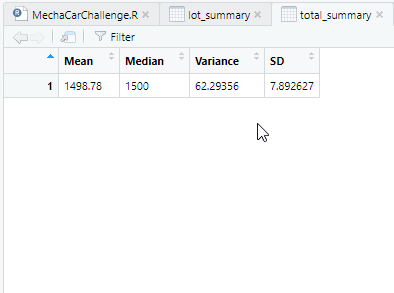
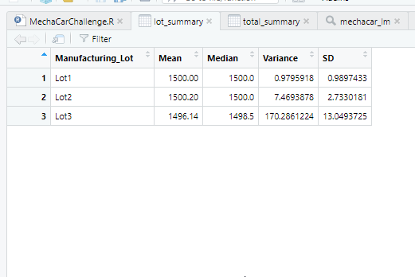
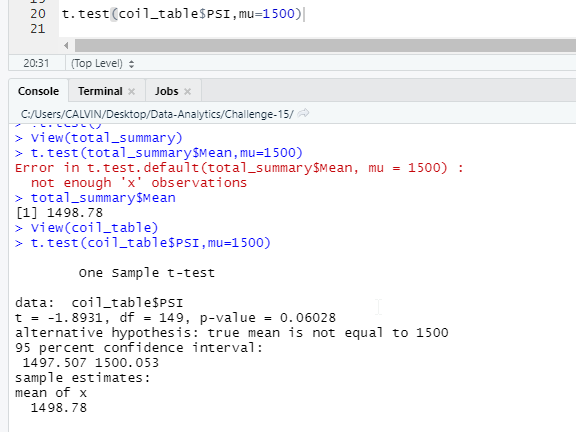

# Statistical Analysis of AutoRU

## Overview

In this analysis, we take a look at various MechaCar data and perform statistical analysis based on the data sets we have. First, we perform a linear regression analysis to find out if there is likely a relationship between vehicle specifications and miles per gallon. In the next two sections, we take a look a the reported suspension coils data to determine if there are issues there. Lastly, we propose a future study to conduct to compare our MechaCars against our competition.

## Linear Regression to Predict

Using the MechaCar dataset we performed regression analysis on whether miles per gallon performance on MechaCars are affected by vehichle length, vehicle weight, spoiler angle, ground clearance and/or AWD specifications. 

Based on the results, we found that it is statistically unlikely that vehicle length and ground clearance of the vehicle (as well as intercept on the linear equation) influence miles per gallon (mpg) by random chance i.e. there is a likely relationship between them, as the p-values are lower than our pre-set 0.05 significance value, as seen in the below chart. 

Furthermore, we find that mpg shows a positive relationship i.e. there is a non-zero positive slope with those aforementioned variables as we see a r-squared value of 0.7149, indicating a moderate fitted line against our data points.

## Summary Statistics on Suspension Coils

Using the suspension coils data set, we were able to product summary statistics to review whether the MechaCar suspension coils meet specifications, where the PSI variance cannot exceed 100 PSI.

When we look at the total summary table below, we see the total variance for the MechaCars are at 62.3 PSI, which seems to indicate that production is meeting specifications.

However, when we dig deeper into the data to split between production batches i.e. in terms of lots, we see lot#1 and lot#2 meeting specifications, where the PSI variance is much lower than the 100 PSI requirement; lot#3 however shows a variance of 170 PSI, much higher than requirements and should require further investigation as to what occured during production.

## T-Tests on Suspension Coils

Referring to our previous analysis, we've found that there may be an issue with lot#3 but need to test if there is a statistical significance to our findings i.e. whether lot#3 was caused by random chance or something else; this can be accomplished by using a t-test on the calculated means of our various findings against our population mean of 1,500 PSI.

When we compare our sample data set against our population mean, we find that there is no statistical significance that something is out of the ordinary with our reported PSI (similar to our findings above) as the p-value of 0.06 is greater than 0.05 (shown in table below).

Similarly, for lot#1 and lot#2, we see that there is no statistical significance in our reported PSI as the p-values (1 & 0.60 respectively) are still greater than 0.05.

For lot#3 however, the t-test shows that there is likely something else not related to chance that is causing a difference between our reported PSI and our population mean value as the p-value (0.04) is lower than 0.05.

## Study Design: MechaCar vs Competition

